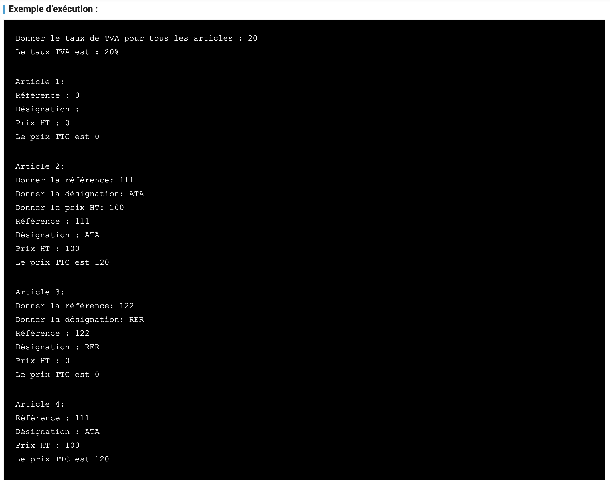

# interface 

## Objectif
1. Définir La structure d'une class
2. Définir les méthodes d’une classe
3. Definir une interface
4. Créer une instance de classe

## Travail a Faire 

1. ==> Créer la classe Article caractérisée par les attributs : Référence, Désignation, PrixHT, TauxTVA.

2. ==> Implémentez la méthode CalculerPrixTTC() ;
    Cette méthode doit calculer le prix TTC d’un article qui équivaut à : ``PrixHT + (PrixHT*TauxTVA/100)`` et retournera la valeur calculée.

3. ==> Ajouter la méthode AfficherArticle() qui affiche les informations de l’article.

4. ==> Le taux de TVA est en fait commun à tous les articles. Pour éviter toute redondance de cet attribut, vous devriez donc Proposer une solution et tester de nouveau.




```go
package main

import (
    "fmt"
)

//We love code
func main() {
    fmt.Println("Hello Gophers ...")
}
```